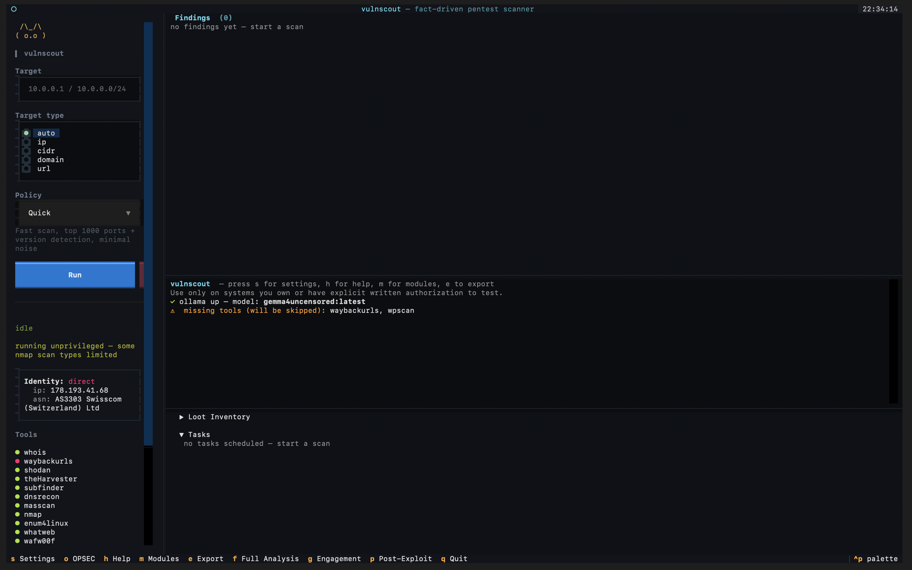

<div align="center">

```
__   __ _   _  _      _   _  ____   ____  ___   _   _  _____
\ \ / /| | | || |    | \ | |/ ___| / ___|/ _ \ | | | ||_   _|
 \ V / | | | || |    |  \| |\___ \| |   | | | || | | |  | |
  \ V /| |_| || |___ | |\  | ___) | |___| |_| || |_| |  | |
   \_/  \___/ |_____||_| \_||____/ \____|\___/  \___/   |_|
```

**A fact-driven, terminal-native penetration-testing orchestrator.**

*One target in. A self-scheduling scan that decides what to run next from what it just learned.*

</div>

<div align="center">



</div>

---

> [!CAUTION]
> ## Authorized use only
>
> vulnscout actively scans, fingerprints, fuzzes, and probes network services. **Running it
> against systems you do not own or do not have *explicit, written* permission to test is
> illegal** in most jurisdictions (e.g. the Computer Fraud and Abuse Act in the US, the
> Computer Misuse Act in the UK, and equivalents elsewhere).
>
> - Use it **only** on your own lab, on machines you control, on CTF/HackTheBox/TryHackMe
>   targets, or under a signed engagement scope.
> - Several actions are loud and intrusive (port scans, directory fuzzing, SQLi probes,
>   credential brute-forcing). Some can disrupt fragile services. **You are responsible for
>   everything it does.**
> - The exploitation/post-exploitation helpers are advisory by default — but they generate
>   real commands for real tools. Think before you run them.
>
> The authors accept **no liability** for misuse. If you don't have authorization, stop here.

---

## What it is

vulnscout is a **real penetration-testing tool**, not a toy. It is an orchestrator that drives
the same industry-standard binaries a human tester reaches for — `nmap`, `nuclei`, `ffuf`,
`sqlmap`, `httpx`, `katana`, `wpscan`, `theHarvester`, `searchsploit`, `netexec`, and ~40 more —
and wires their output back into a shared, provenance-tracked knowledge base that decides what to
run next.

It has been used in authorized testing (lab boxes, CTF/THM/HTB targets, and scoped engagements)
and **has surfaced genuine vulnerabilities** — exposed `.env` and `.git` directories leaking live
credentials, unauthenticated Redis/Mongo/Elasticsearch instances, anonymous FTP and SMB null
sessions, default web-panel logins, injectable forms, and CVE-bearing service versions
cross-referenced straight to working Exploit-DB and Metasploit modules. The findings are real
because the tools are real; vulnscout's contribution is orchestration, correlation, and
de-duplication so you stop copy-pasting between fifteen terminals.

### The core idea: a fact-driven scheduler

Most scanners run a fixed pipeline: recon → scan → report. vulnscout instead models a scan as an
**append-only log of typed facts** feeding a **DAG scheduler**:

1. You seed one `Target` fact.
2. Every tool is a **Task** that declares the fact *kinds* it consumes (`requires`) and the kinds
   it emits (`produces`).
3. When a new fact lands, the scheduler queues every task whose requirements are now satisfied —
   gated by your policy, de-duplicated, and run in parallel.
4. New output becomes new facts, which wake more tasks, until the graph settles. Then synthesis
   tasks (intel summary + LLM analysis) fire with the complete picture.

The payoff is **automatic, explainable depth**. `nmap` finds port 443 → `httpx` confirms it's
live → `whatweb` fingerprints WordPress → `wpscan` fires *only because* WordPress was detected.
Every fact records the task that produced it and the parent facts that triggered it, so you can
always answer *"why did this run?"* by walking the provenance chain.

---

## Features

### Reconnaissance & OSINT (passive — no packets to the target)
- WHOIS, DNS enumeration + zone-transfer attempts (`dnsrecon`), DNSSEC detection
- Subdomain discovery via certificate transparency (`crt.sh`), `subfinder`, and `theHarvester`
- Shodan **InternetDB** free lookups (ports + known CVEs), `ipinfo.io` ASN/geo, reverse-IP
- Email harvesting (`theHarvester`, optional `hunter.io`), GitHub code-search for leaked secrets
- Historical URL mining via the Wayback Machine (flags `admin`, `login`, `.env`, `.git`, …)

### Network discovery
- `masscan`/`naabu` fast pre-sweep on CIDR ranges → feeds live hosts to `nmap`
- `nmap` service/version/OS detection with policy-driven intensity
- `httpx` live-HTTP confirmation and tech detection across discovered ports

### Web fingerprinting & scanning
- `whatweb` tech detection, `wafw00f` WAF detection, `katana` headless crawl (form discovery)
- `nuclei` template scanning, `nikto` server scan, `sslscan` TLS/cipher audit
- `ffuf` (with `gobuster` fallback) directory fuzzing — flags `.env`/`.git`/config/backup as HIGH
- `sqlmap` injection testing — fires automatically when forms or query-string params are found
- `wpscan` — fires automatically when WordPress is detected

### Exposure probes (high-signal, low-noise)
- Unauthenticated **Redis**, **MongoDB**, **Elasticsearch**
- **Anonymous FTP**, **SMB null sessions**
- Sensitive-file probing (`.env`, `.git/HEAD`, `wp-config.php`, `actuator/env`, `swagger.json`, …)
  with body scanning for **credentials, API keys, private keys, tokens, internal hosts, and
  software versions** — harvested straight into the Loot Inventory.

### Exploit cross-referencing
- `searchsploit` correlates discovered service/product versions against local Exploit-DB
- `msfconsole` maps discovered CVEs to available Metasploit modules — **suggestions only, never
  auto-run**

### LLM analysis (local, optional)
- Ollama-backed. Summarizes raw tool output in one plain sentence, then synthesizes a final
  **attack-angle analysis** (top angles → confirming conditions → next steps) from the full fact
  log + loot.
- **Severity is computed deterministically from raw output — the LLM never grades it**, it only
  explains. Everything degrades gracefully to a deterministic fallback if Ollama isn't running.

### Operational security (single chokepoint)
- Route every subprocess through **Tor** (`torsocks`) or **proxychains**
- Randomized inter-tool delays, per-request **User-Agent randomization**
- `nmap` source-port spoofing (`--source-port 53`) and packet fragmentation (`-f`)
- Upstream HTTP proxy support (Burp / ZAP / mitmproxy) for web tools
- Tor/VPN detection + a pre-scan **anonymity warning** when hitting an external target unprotected
- `stealth` and `paranoid` policies auto-enable the evasion stack

### Authenticated scanning
- Inject session **cookies**, **bearer tokens**, **basic-auth**, or arbitrary **custom headers**
  into web tools (`ffuf`, `nuclei`, `nikto`, `sqlmap`, `gobuster`, `wpscan`, `whatweb`, `httpx`,
  `katana`) — each tool's real flags handled for you, including those that ignore `HTTP_PROXY`.

### Interactive engagement (post-discovery exploitation guidance)
- Builds a queue of **user-approvable** actions from what was found: default-credential web
  probes (Grafana/Jenkins/Tomcat/phpMyAdmin/…), SSH/SMB brute-forcing, service enumeration
  (enum4linux, ldapsearch, snmpwalk, NFS, AXFR), and a full **Active Directory** toolkit
  (`netexec`, `kerbrute` AS-REP roasting, `certipy` ADCS, BloodHound, Responder/ntlmrelayx hints,
  `evil-winrm`).
- Risk-gated: PASSIVE/LOW/MEDIUM single-confirm, HIGH double-confirm, CRITICAL requires typing a
  confirmation phrase. **Nothing executes without your explicit approval.**

### Post-exploitation helper (privilege escalation)
- "You're in the box" mode (key `p`): OS-aware enumeration checklists (Linux/Windows), a 44-entry
  **GTFOBins** escape table, version-matched **kernel-exploit** matching (DirtyCow, DirtyPipe, …),
  and analyzers that turn pasted `sudo -l` / SUID / `getcap` / `systeminfo` / `whoami /priv`
  output into ranked, referenced suggestions. **It never executes anything** — every lead links to
  GTFOBins / Exploit-DB.

### Quality-of-life
- One-screen **TUI** (Textual): one Run button, live findings grouped by severity, a growing loot
  panel, and a "what's running now" task view.
- Built-in **module installer** (key `m`): installs missing scanning tools — including a
  root-aware *Install All + sudo* — and re-checks PATH **without restarting**.
- Markdown **report export** (key `e`) with intel summary, ports table, severity-grouped findings,
  full loot inventory, LLM analysis, and available MSF modules.
- Stdlib `unittest` suite (no heavy deps) that statically guards every task and fact definition.

---

## Quick start

> vulnscout is **TUI-only** and runs on macOS and Linux. It needs Python ≥ 3.9 (3.11+
> recommended — Textual ≥ 0.50 won't import on older/stock interpreters).

```bash
# 1. Clone (keep the directory named "vulnscout" — it's a Python package)
git clone https://github.com/mootb0t/vulnscout.git
cd vulnscout

# 2. One-time setup: creates a local .venv and installs Python deps
./install.sh

# 3. Launch
./run.sh
```

`./run.sh` finds a suitable Python (preferring the `.venv` from `install.sh`), changes to the
parent directory, and runs the package for you. Override the interpreter with
`VULNSCOUT_PYTHON=/path/to/python ./run.sh`.

<details>
<summary><b>Manual / no-script invocation</b></summary>

The package is invoked as a module **from its parent directory**:

```bash
pip install -r vulnscout/requirements.txt   # textual, ollama, python-nmap

# From the directory that CONTAINS vulnscout/
python3 -m vulnscout
```

On macOS the stock `python3` is usually too old for Textual — use Homebrew's
`/opt/homebrew/bin/python3.11` (or similar).
</details>

### Installing the scanning tools

Python deps alone don't include the scanners. vulnscout looks up external binaries on `PATH` via
`shutil.which` and **silently skips any that are missing** — so it runs even with nothing
installed, just with fewer capabilities (the startup banner lists what's missing).

The easiest path: launch the app, press **`m`** for the Modules screen, and click **Install All**
(or **Install All + sudo** when root is needed). It picks the right package manager per platform
(brew → pipx → pip → gem → go → curl on macOS; apt-get-first on Linux), fixes up `PATH`, and
flips tools to ✓ without a restart.

---

## Using the TUI

1. **Target** — type an IP, CIDR, domain, or URL.
2. **Target type** — leave on `auto` or pick `ip` / `cidr` / `domain` / `url`.
3. **Policy** — choose how aggressive/stealthy the scan is (see table below).
4. **Run** — the scheduler takes over. Findings, loot, and live tasks stream into the panels.

### Keyboard shortcuts

| Key | Action | Key | Action |
|----:|--------|----:|--------|
| `s` | Settings | `g` | Engagement (exploitation queue) |
| `o` | OPSEC / anonymity | `p` | Post-Exploit (privilege escalation) |
| `m` | Modules (tool installer) | `e` | Export report (Markdown) |
| `h` | Help | `f` | Full Analysis (LLM) |
| `q` | Quit | `^p` | Command palette |

### Policies

| Policy | What it does |
|--------|--------------|
| **Quick** | Fast — top 1000 ports + version detection, minimal noise. *(default)* |
| **Full** | Balanced — top 5000 ports, version detection, common vulns. |
| **Thorough** | All 65535 ports, every script. Slow. |
| **Stealth** | IDS evasion + decoy scanning. Auto-enables the OPSEC stack. Very slow. |
| **Paranoid** | Extreme evasion; disables the loudest tools. May take hours. |
| **Internal** | Assume-breach / internal network — skips public OSINT, full port range, AD-focused probes. |

Policies are declarative: they filter the task graph by tag/id and tune each tool's knobs. Adding
a new tool never requires editing a policy.

---

## How it's built (for contributors)

```
core/        the engine — facts, store, tasks, scheduler, events, policy, orchestrator
plugins/     every tool is a Task that registers itself at import time
phases/      legacy ScanState bridge for the mature interactive engagement module
tools/       subprocess runner + output parsers (deterministic severity lives here)
opsec.py     single rewrite chokepoint for Tor/proxy/delay/UA/nmap-evasion
auth.py      single chokepoint for authenticated-scan flags, per-tool
modules.py   the one source of truth for every external binary + how to install it
privesc.py   pure, textual-free privilege-escalation knowledge base + analyzers
llm.py       Ollama client — translate (summarize) + synthesize (analysis) only
report.py    Markdown export
app.py       the Textual TUI
```

**Adding a tool** is a three-line affair: drop a file in `plugins/`, declare a `Task` with its
`requires`/`produces` fact kinds, call `register(Task(...))`, and (if it's a new binary) add one
entry to `modules.py`. No edits anywhere else — the scheduler discovers it automatically.

### Tests

A stdlib `unittest` suite (no Textual required) acts as a contract guard — it statically checks
every task's trigger logic and every fact constructor's kwargs against its dataclass fields, the
two ways a task can break *silently*.

```bash
# From the directory that contains vulnscout/
python3 -m unittest discover -t . -s vulnscout/tests -p "test_*.py"
```

---

## Configuration

Settings persist to `~/.config/vulnscout/settings.json` (honors `$XDG_CONFIG_HOME`) and are
edited from the Settings (`s`) and OPSEC (`o`) screens — opsec toggles, auth credentials, the
`hunter.io` API key, and the Ollama model. Reports are written to `./reports/`.

---

## License & legal

This software is provided for **authorized security testing and educational use only**. By using
it you agree that you have permission to test the targets you point it at, and that you alone are
responsible for complying with all applicable laws. See the disclaimer at the top of this file —
it is not boilerplate.
